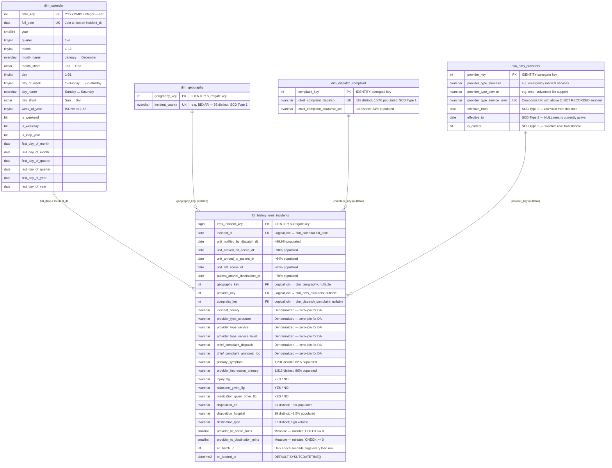

# EMS Data Engineering Pipeline

**Domain:** Emergency Medical Services (EMS) — NEMSIS-aligned operational data  
**Methodology:** Kimball Dimensional Modeling (Star Schema)  
**Target Platform:** SQL Server  
**Language:** Python 3.12  

---

## Table of Contents

1. [Architecture & Flow](#1-architecture--flow)
2. [Repository Structure](#2-repository-structure)
3. [How to Run End-to-End](#3-how-to-run-end-to-end)
4. [Configuration Reference](#4-configuration-reference)
5. [Data Model — Grain, Dimensions & Fact (Gold Layer)](#5-data-model--grain-dimensions--fact-gold-layer)
6. [Data Quality Rules](#6-data-quality-rules)
7. [Incremental Load Strategy](#7-incremental-load-strategy)
8. [Logging & Error Handling](#8-logging--error-handling)
9. [Assumptions & Decisions](#9-assumptions--decisions)

---

## 1. Architecture & Flow

The pipeline follows a **four-phase ETL** pattern implementing a **three-layer Medallion Architecture** (Bronze → Silver → Gold). All SQL is externalized into `.sql` files; Python orchestrates execution only.

```
┌──────────────┐     ┌──────────────────────────────────────────────────────────┐
│  Source CSV  │     │  ETL Pipeline (main.py)                                  │
│              │     │                                                           │
│ ems_runs_    │────▶│  extract.py          transform.py         load.py        │
│ YYYY.csv     │     │  ┌──────────┐        ┌──────────┐         ┌──────────┐   │
│ ~1.6M rows   │     │  │ Chunked  │──────▶ │ Validate │──┬────▶ │ Stage    │   │
│ 22 columns   │     │  │ CSV read │        │ Normalize│  │      │ Raw &    │   │
└──────────────┘     │  └──────────┘        └──────────┘  │      │ Clean    │   │
                     │                                     │      └──────────┘   │
                     │                              rejects│                     │
                     │                              .csv ◀─┘                    │
                     └──────────────────────────────────────────────────────────┘
                                                                  │
                     ┌────────────────────────────────────────────▼─────────────┐
                     │  SQL Server  —  {env}_ems schema                         │
                     │                                                           │
                     │  ┌──────────────┐    ┌──────────────┐                    │
                     │  │ stg_ems_raw  │    │ stg_ems_clean│  BRONZE / SILVER   │
                     │  │ (HEAP · all  │    │ (typed ·     │  Staging Layers    │
                     │  │  NVARCHAR)   │    │  normalized) │                    │
                     │  └──────────────┘    └──────┬───────┘                    │
                     │                             │  DQ checks (8 assertions)  │
                     │                             │  ❌ FAIL → pipeline aborts │
                     │                             ▼                            │
                     │            ┌────────────────────────────┐                │
                     │            │   MERGE → dim_geography    │                │
                     │            │   MERGE → dim_dispatch_    │  GOLD          │
                     │            │           complaint        │  Dimension     │
                     │            │   MERGE → dim_ems_providers│  Layer         │
                     │            └────────────────┬───────────┘                │
                     │                             │                            │
                     │            ┌────────────────▼───────────┐                │
                     │            │  INSERT…SELECT             │  GOLD          │
                     │            │  fct_history_ems_incidents │  Fact Layer    │
                     │            └────────────────────────────┘                │
                     └──────────────────────────────────────────────────────────┘
```

### Medallion Architecture — Three Layers

| Layer | Medal | Table(s) | Purpose |
|---|---|---|---|
| Raw | 🥉 Bronze | `stg_ems_raw` | Every source row lands here verbatim — all NVARCHAR, heap table. Permanent audit trail; never deleted by the pipeline. |
| Clean | 🥈 Silver | `stg_ems_clean` | Transform output — parsed dates, cast numerics, case-normalized strings. Sole source for all Gold layer SQL loads. |
| Warehouse | 🥇 Gold | `dim_*` + `fct_history_ems_incidents` | Kimball star schema — conformed dimensions and enriched fact table optimized for analytical queries. |

### Set-based Gold Layer Loading

Dimension tables (Gold) are populated via SQL Server `MERGE` statements (`load_dims.sql`).  
The fact table (Gold) is populated via a single `INSERT…SELECT` with `LEFT JOIN` to all dims (`load_fact.sql`).  
No Python-side loops or in-memory caches are used for Gold layer loading — all logic runs inside SQL Server.

---

## 2. Repository Structure

```
EMS/
├── main.py                         # Pipeline entry point
├── requirements.txt                # Python dependencies
├── README.md
├── .gitignore
│
├── config/
│   └── config.yaml                 # All runtime parameters (file path, env, batch size, etc.)
│
├── etl/                            # Python ETL package
│   ├── __init__.py
│   ├── extract.py                  # Chunked CSV reader
│   ├── transform.py                # Validation, normalization, reject quarantine
│   └── load.py                     # Staging writes, DQ checks, DW SQL execution
│
├── sql/
│   ├── ddl/                        # Schema setup — run once per environment
│   │   ├── init_schema.sql         # CREATE SCHEMA {schema}
│   │   ├── staging.sql             # stg_ems_raw, stg_ems_clean
│   │   ├── dimensions.sql          # dim_calendar, dim_geography,
│   │   │                           #   dim_dispatch_complaint, dim_ems_providers
│   │   └── facts.sql               # fct_history_ems_incidents
│   └── dml/                        # Runtime SQL — Silver → Gold promotion
│       ├── dq_checks.sql           # 8 post-staging assertions (Silver gate)
│       ├── load_dims.sql           # MERGE into Gold dim tables
│       └── load_fact.sql           # INSERT…SELECT into Gold fact table
│
├── data/
│   ├── sample.csv                  # Committed — small reference file
│   └── ems_runs_2024 (1).csv       # Gitignored — large source CSV
│
├── docs/
│   ├── star_schema_erd.md          # ERD (Mermaid), SCD table, index reference
│   └── data_dictionary.csv         # Field-level descriptions (from source documentation)
│
├── logs/                           # Runtime — one log file per run (gitignored)
└── rejects/                        # Runtime — one reject CSV per run (gitignored)
```

---

## 3. How to Run End-to-End

### Prerequisites

| Requirement | Version |
|---|---|
| Python | 3.12+ |
| SQL Server | 2017+ (or Azure SQL) |
| ODBC Driver | 17 or 18 for SQL Server |

### Step 1 — Install Python dependencies

```bash
pip install -r requirements.txt
```

`requirements.txt` includes: `pandas>=2.0.0`, `numpy>=1.24.0`, `PyYAML>=6.0`, `SQLAlchemy>=2.0.0`, `pyodbc>=4.0.39`.

### Step 2 — Configure the connection

Edit `config/config.yaml` and set the connection string for your environment:

```yaml
environment: dev      # dev | test | prod

db:
  dev:  "mssql+pyodbc://localhost/ems_dev?driver=ODBC+Driver+17+for+SQL+Server&trusted_connection=yes"
  test: "mssql+pyodbc://TEST_SERVER/ems_test?driver=ODBC+Driver+17+for+SQL+Server&trusted_connection=yes"
  prod: "mssql+pyodbc://SERVER/DATABASE?driver=ODBC+Driver+17+for+SQL+Server&trusted_connection=yes"
```

### Step 3 — Database setup (automatic)

The pipeline calls `init_db()` at startup before any data is processed.
It reads all four DDL files in dependency order and executes each
`IF NOT EXISTS` block — **safe to run on every execution, no manual SQL required**.

```
Pipeline startup (automatic):
  sql/ddl/init_schema.sql  → CREATE SCHEMA dev_ems  (if not exists)
  sql/ddl/staging.sql      → stg_ems_raw, stg_ems_clean  (if not exist)
  sql/ddl/dimensions.sql   → dim_calendar, dim_geography, ...  (if not exist)
  sql/ddl/facts.sql        → fct_history_ems_incidents  (if not exists)
```

> **Note:** `dim_calendar` (date spine 1990–2100, ~40,541 rows) is created
> automatically by `init_db()` but must be populated separately with a
> calendar generation script before the first fact load.

### Step 4 — Run the pipeline

```bash
# Full load — all defaults from config.yaml
python main.py

# Override source file
python main.py --file "data/ems_runs_2024 (1).csv"

# Run against a specific environment
python main.py --env prod

# Incremental load — only DW-load rows where incident_dt >= 2024-06-01
python main.py --env test --load-mode incremental --from-date 2024-06-01

# Load a different year's file to production
python main.py --file "data/ems_runs_2023.csv" --env prod
```

**CLI arguments always override `config.yaml`.**

### Step 5 — Review outputs

| Output | Location | Description |
|---|---|---|
| Live log | stdout | INFO and above — progress per chunk |
| Run log file | `logs/etl_<year>_<YYYYMMDD_HHMMSS>.log` | DEBUG and above — full detail |
| Reject file | `rejects/rejects_<year>_<YYYYMMDD_HHMMSS>.csv` | Rows that failed validation |

### Exit Codes

| Code | Meaning |
|---|---|
| `0` | Pipeline completed successfully (check reject count in final log line) |
| `1` | Unrecoverable error — DQ failure or exception; DW tables were not written |

---

## 4. Configuration Reference

All parameters live in `config/config.yaml`. CLI arguments override them at runtime.

| Parameter | Default | CLI Override | Description |
|---|---|---|---|
| `file_path` | `data/ems_runs_2024 (1).csv` | `--file` | Source CSV path relative to project root |
| `environment` | `dev` | `--env` | Selects the DB connection string (`dev`/`test`/`prod`) |
| `load_mode` | `full` | `--load-mode` | `full` loads all rows; `incremental` filters DW load by date |
| `incremental_from_date` | `null` | `--from-date` | Lower-bound `incident_dt` for incremental DW load (YYYY-MM-DD) |
| `batch_size` | `10000` | — | Rows per CSV chunk (controls memory footprint) |
| `log_dir` | `logs` | — | Directory for log files |
| `reject_dir` | `rejects` | — | Directory for reject CSVs |
| `db.dev` / `db.test` / `db.prod` | — | — | SQLAlchemy connection strings |

---

## 5. Data Model — Grain, Dimensions & Fact (Gold Layer)

Full ERD with Mermaid diagrams, SCD table, and index reference: [`docs/star_schema_erd.md`](docs/star_schema_erd.md)

### Star Schema ERD

> **Note on relationships:** Foreign key constraints are not enforced at the database level.  
> Surrogate keys on the fact (`geography_key`, `provider_key`, `complaint_key`) are **nullable INT**.  
> `dim_calendar` is joined via `incident_dt = full_date` (date match), not a surrogate key.  
> All joins are **logical only**.



### Grain

**`fct_history_ems_incidents`** — one row per EMS run (one row from the source CSV).

### Fact Table

| Column Group | Columns | Notes |
|---|---|---|
| Primary key | `ems_incident_key` | BIGINT IDENTITY |
| Date milestones | `incident_dt`, `unit_notified_by_dispatch_dt`, `unit_arrived_on_scene_dt`, `unit_arrived_to_patient_dt`, `unit_left_scene_dt`, `patient_arrived_destination_dt` | All DATE or NULL |
| Dimension keys | `geography_key`, `provider_key`, `complaint_key` | Nullable INT; no FK constraints |
| Denormalized values | All natural-key and descriptive columns from dims | Zero-join access for DA/DS |
| Measures | `provider_to_scene_mins`, `provider_to_destination_mins` | SMALLINT; CHECK >= 0 |
| Flags | `injury_flg`, `naloxone_given_flg`, `medication_given_other_flg` | YES / NO / NULL |
| Disposition | `disposition_ed`, `disposition_hospital`, `destination_type` | Degenerate dimensions |
| Clinical | `primary_symptom`, `provider_impression_primary` | High-cardinality text |
| ETL audit | `etl_batch_id`, `etl_loaded_at` | Batch tracking |

### Dimensions

| Table | SCD | Natural Key | Notes |
|---|---|---|---|
| `dim_calendar` | Type 0 | `full_date` | Pre-populated date spine 1990–2100; joined via date match |
| `dim_geography` | Type 1 | `incident_county` | 93 distinct Texas counties; overwrite on correction |
| `dim_dispatch_complaint` | Type 1 | `chief_complaint_dispatch` | 118 NEMSIS dispatch codes; overwrite on NEMSIS version update |
| `dim_ems_providers` | Type 2 | `structure + service + level` | Certification upgrades tracked; `effective_from/to`, `is_current` |

### Dimension Key Design

- Surrogate keys are generated by SQL Server `IDENTITY(1,1)` — no Python-side key generation.
- Foreign keys on the fact are **nullable** with **no database-level FK constraints**.  
  Rationale: source data availability may lag dimension population; NULL means "no match found in this batch" — fact rows are never discarded.
- The fact table is **wide/enriched** — every denormalized value from the source is stored directly on the fact so analysts never need to join to a dimension for common queries.

---

## 6. Data Quality Rules

DQ is enforced in **two stages**:

### Stage 1 — Python Transform (`etl/transform.py`)

Runs per-chunk before staging. Invalid rows are **rejected** (never reach `stg_ems_clean`).

| Rule | Action |
|---|---|
| Unparseable date in any date column | Row rejected — `reject_reason: "Unparseable date in column: <col>"` |
| Negative value in `provider_to_scene_mins` or `provider_to_destination_mins` | Row rejected — `reject_reason: "Negative value in column: <col>"` |
| NULL in `incident_dt` (required field) | Row rejected — `reject_reason: "Null in required column: incident_dt"` |
| NULL in `incident_county` (required field) | Row rejected — `reject_reason: "Null in required column: incident_county"` |
| Blank string in any column | Converted to `pd.NA` (treated as NULL) |
| Blank `provider_type_service_level` | Replaced with sentinel `"NOT RECORDED"` (prevents UNIQUE INDEX violations) |

Rejected rows are collected across all chunks and written once per run to:  
`rejects/rejects_<year>_<YYYYMMDD_HHMMSS>.csv`

### Stage 2 — SQL Assertions (`sql/dml/dq_checks.sql`)

Runs after all chunks are staged, against `stg_ems_clean` for the current `etl_batch_id`.  
**Any failed check aborts the pipeline** — dim and fact tables are not written.

| Check Name | Threshold | Rationale |
|---|---|---|
| `row_count` | > 0 | At least one row must be staged |
| `null_incident_dt` | = 0 | Required field; transform already rejects nulls — residual = code bug |
| `null_incident_cnty` | = 0 | Required field; same rationale |
| `null_complaint_dispatch` | = 0 | 100% populated in source — NULL signals file corruption |
| `neg_scene_mins` | = 0 | Transform rejects negatives — residual = code bug |
| `neg_dest_mins` | = 0 | Same |
| `future_incident_dt` | = 0 | EMS incidents cannot occur in the future |
| `invalid_injury_flg` | = 0 | After transform, only YES / NO / NULL are valid values |

### Recovery from DQ Failure

```sql
-- Delete staged rows for the failed batch
DELETE FROM {schema}.stg_ems_raw   WHERE etl_batch_id = <batch_id>;
DELETE FROM {schema}.stg_ems_clean WHERE etl_batch_id = <batch_id>;
-- Fix root cause, then re-run: python main.py --file "data/ems_runs_YYYY.csv"
```

---

## 7. Incremental Load Strategy

### Design

The pipeline supports two load modes, controlled by `load_mode` in `config/config.yaml` or `--load-mode` CLI flag.

| Mode | Staging Behavior | DW Load Behavior |
|---|---|---|
| `full` | All rows staged to `stg_ems_raw` and `stg_ems_clean` | All rows in the batch loaded to dims and fact |
| `incremental` | All rows staged (auditability preserved) | Only rows where `incident_dt >= incremental_from_date` are MERGEd into dims and INSERTed into fact |

### Key Design Decisions

- **`incident_dt` is the incremental filter column** — the primary incident date is the most meaningful business key for time-based windowing.
- **Staging is always full** — every raw row is preserved in `stg_ems_raw` regardless of load mode. This ensures auditability and allows historical reprocessing without re-extracting from the source.
- **Same SQL for both modes** — the filter predicate `(:inc_from IS NULL OR incident_dt >= :inc_from)` handles both full and incremental with the same static SQL in `load_dims.sql` and `load_fact.sql`. No dynamic SQL required.
- **Re-runnability** — every row in every table carries `etl_batch_id` (Unix epoch seconds). Running the pipeline twice on the same file appends a second copy with a new `batch_id`. To reprocess cleanly, delete rows for the previous `batch_id` and re-run.

### Running an Incremental Load

```bash
# Load only incidents from June 2024 onwards into the DW
python main.py \
  --file "data/ems_runs_2024 (1).csv" \
  --load-mode incremental \
  --from-date 2024-06-01 \
  --env prod
```

### Multi-Year Processing

The pipeline is **year-agnostic**. Run it sequentially for each year's file:

```bash
python main.py --file "data/ems_runs_2022.csv" --env prod
python main.py --file "data/ems_runs_2023.csv" --env prod
python main.py --file "data/ems_runs_2024 (1).csv" --env prod
```

`source_year` and `source_file` columns on both staging tables identify which CSV produced each row.

---

## 8. Logging & Error Handling

### Log Handlers

Two handlers are active for every pipeline run:

| Handler | Level | Destination | Format |
|---|---|---|---|
| `StreamHandler` | INFO+ | stdout | Live progress — visible during execution |
| `FileHandler` | DEBUG+ | `logs/etl_<year>_<YYYYMMDD_HHMMSS>.log` | Full detail — persisted for post-mortem |

One log file is created per run. The filename encodes the source year and run timestamp for easy archiving.

### Log Structure

Every required metric is emitted as a structured log line:

```
2024-01-15 09:00:00 | INFO     | __main__ | RUN START  batch_id=1705312800  file=data/ems_runs_2024 (1).csv  year=2024  env=prod  schema=prod_ems  load_mode=full
2024-01-15 09:00:01 | INFO     | __main__ | STEP  extract + stage
2024-01-15 09:00:03 | INFO     | __main__ | Chunk | extracted= 10000  staged_raw= 10000  staged_clean= 9987  rejected=13
2024-01-15 09:00:05 | INFO     | __main__ | STEP  dq_checks
2024-01-15 09:00:05 | INFO     | etl.load | DQ PASS: stg_ems_clean row count = 9987  batch_id=1705312800
2024-01-15 09:00:06 | INFO     | __main__ | STEP  load_dims
2024-01-15 09:00:07 | INFO     | __main__ | STEP  load_fact
2024-01-15 09:00:08 | INFO     | __main__ | RUN END  status=SUCCESS   elapsed=   8.3s  extracted=10000  staged_raw=10000  staged_clean=9987  loaded=9987  rejected=13
2024-01-15 09:00:08 | WARNING  | __main__ | 13 row(s) rejected — see rejects/rejects_2024_20240115_090000.csv
```

### Row Counts Tracked

| Metric | Logged at |
|---|---|
| `extracted` | Per chunk + run total |
| `staged_raw` | Per chunk + run total |
| `staged_clean` | Per chunk + run total |
| `rejected` | Per chunk + run total |
| `loaded` (fact rows) | Run total via `result.rowcount` after INSERT |

### Error Handling

| Failure Type | Behavior |
|---|---|
| DQ check failure | `RuntimeError` raised → pipeline aborts before any DW write; exit code 1 |
| Unparseable date / negative measure | Row quarantined to reject CSV; pipeline continues |
| Unhandled exception | `logger.exception()` logs full traceback; `finally` block writes reject file and prints run summary; exit code 1 |
| Unresolved dim key | Fact row still inserted with `NULL` surrogate key — no data loss |

### Graceful Shutdown

The `try / except / finally` block in `main.py` guarantees that even on failure:
- The reject CSV is always written (if any rejects exist)
- The final `RUN END` summary is always logged with `status=FAILED` and elapsed time
- The process exits with code `1` for CI/CD pipeline detection

---

## 9. Assumptions & Decisions

| Topic | Decision | Rationale |
|---|---|---|
| **Source format** | Year-agnostic pipeline; filename determines `source_year` | Enables sequential multi-year loading without code changes |
| **Staging** | Two tables: `stg_ems_raw` (all NVARCHAR heap) + `stg_ems_clean` (typed) | Raw table provides permanent audit trail; clean table is the sole DW source — no mixed-purpose staging |
| **FK constraints** | Not enforced at DB level; surrogate keys on fact are nullable | Source data may not always yield a dim match in the same batch; no fact rows are ever discarded due to lookup failures |
| **Unknown members** | Removed (`-1` pattern not used) | Nullable keys are cleaner than a synthetic -1 row; NULLs are explicit and easier to filter in analysis |
| **Denormalized fact** | All dim attribute values are stored on the fact in addition to surrogate keys | Zero-join access for DA/DS — most operational dashboards need county, complaint, and provider type without joins |
| **DW loading** | SQL `MERGE` for dims, `INSERT…SELECT` for fact | Set-based SQL Server operations are significantly faster than row-by-row Python inserts for 1M+ row datasets |
| **Chunked reading** | `batch_size = 10,000` rows per chunk | Bounds memory usage; a 1.6M-row CSV fits in ~10 MB per chunk vs. ~160 MB if fully loaded |
| **Column casing** | Single-word codes → UPPER, multi-word descriptions → lower | Consistent normalization prevents case-sensitivity mismatches in MERGE natural key joins |
| **DQ failure behavior** | Pipeline aborts before any DW write on DQ failure | Prevents partial or corrupt data reaching the fact table; staging rows are kept for triage |
| **SCD Type 2 for providers** | `effective_from`, `effective_to`, `is_current` columns on `dim_ems_providers` | Agency certification level upgrades (BLS→ALS) must be traceable — historical incidents must reference the level active at the time |
| **Schema naming** | `{env}_ems` (e.g. `dev_ems`, `test_ems`, `prod_ems`) | Isolates environments in the same SQL Server instance; all SQL uses a `{schema}` placeholder substituted at runtime |
| **SQL externalization** | All DDL in `sql/ddl/`, all DML in `sql/dml/` | SQL reviewed and versioned independently; `SQLLoader` class reads files and exposes named queries as Python attributes |
| **No SQLite** | SQL Server only | Assessment targets production SQL Server; SQLite has incompatible DDL (no `IDENTITY`, no `MERGE`, no `DATETIME2`) |
