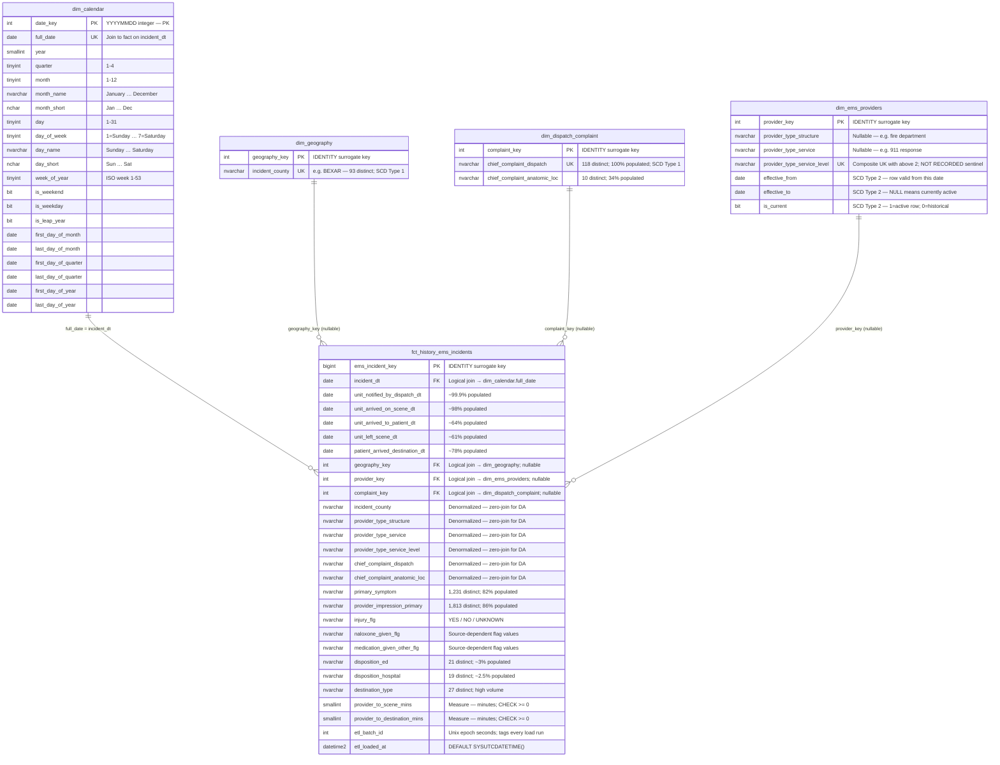
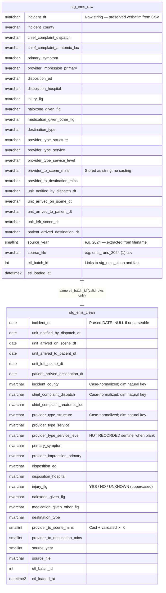
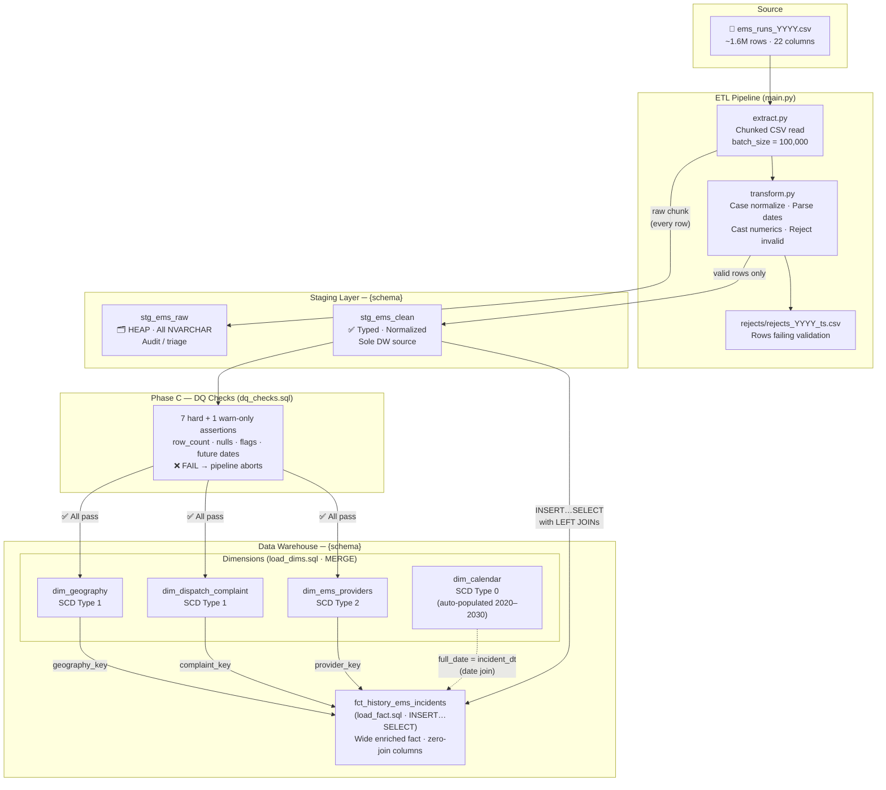

# EMS Data Warehouse — Entity Relationship Diagram

**Project:** Emergency Medical Services (EMS) Analytics  
**Methodology:** Kimball Dimensional Modeling (Star Schema)  
**Target Platform:** SQL Server — schema `{env}_ems` (e.g. `dev_ems`, `test_ems`, `prod_ems`)  
**Grain:** One row per EMS run (one source CSV row)  
**Last Updated:** 2026-04-12  

---

## 1. Star Schema — Warehouse Layer

> **Note on relationships:** Foreign key constraints are not enforced at the database level.  
> Surrogate keys on the fact (`geography_key`, `provider_key`, `complaint_key`) are **nullable INT**.  
> `dim_calendar` is joined via `incident_dt = full_date` (date match), not a surrogate key.  
> All joins are **logical only** — modelled here for documentation purposes.



---

## 2. Staging Layer

> The staging layer is **not part of the DW model** — it exists solely for the ETL pipeline.  
> Both tables are year-agnostic and append-only. `etl_batch_id` links every row back to its pipeline run.



---

## 3. ETL Data Flow



---

## 4. SCD Strategy Reference

| Table | SCD Type | Strategy | Rationale |
|---|---|---|---|
| `dim_calendar` | Type 0 | Static — rows never change | Date attributes are immutable facts |
| `dim_geography` | Type 1 | Overwrite in place | County names are stable; corrections replace the old value |
| `dim_dispatch_complaint` | Type 1 | Overwrite in place | NEMSIS dispatch codes updated at source version level |
| `dim_ems_providers` | Type 2 | Insert new row; close old | Certification level upgrades (BLS→ALS) must be traceable in history |

---

## 5. Index Reference

| Table | Index Name | Columns | Type | Purpose |
|---|---|---|---|---|
| `dim_calendar` | `uix_calendar_date` | `full_date` | UNIQUE NONCLUSTERED | Date join from fact |
| `dim_geography` | `uix_geography_county` | `incident_county` | UNIQUE NONCLUSTERED | MERGE natural key lookup |
| `dim_dispatch_complaint` | `uix_complaint` | `chief_complaint_dispatch` | UNIQUE NONCLUSTERED | MERGE natural key lookup |
| `dim_ems_providers` | `uix_providers` | `structure, service, level` WHERE `is_current=1` | UNIQUE NONCLUSTERED (filtered) | Enforce one active row per provider |
| `fct_history_ems_incidents` | `ix_fct_incident_dt` | `incident_dt` INCLUDE measures | NONCLUSTERED | Time-series dashboard filter |
| `fct_history_ems_incidents` | `ix_fct_county` | `incident_county` | NONCLUSTERED | Geographic group-by |
| `fct_history_ems_incidents` | `ix_fct_provider` | `provider_key` INCLUDE provider cols | NONCLUSTERED | Dimensional join + service analysis |
| `fct_history_ems_incidents` | `ix_fct_batch` | `etl_batch_id` | NONCLUSTERED | Batch-level reloads / deletes |
| `stg_ems_raw` | `ix_raw_batch` | `etl_batch_id` | NONCLUSTERED | Idempotent batch deletes |
| `stg_ems_raw` | `ix_raw_year` | `source_year` | NONCLUSTERED | Per-year staging queries |
| `stg_ems_clean` | `ix_stgc_batch` | `etl_batch_id` | NONCLUSTERED | DQ checks + DW load filter |
| `stg_ems_clean` | `ix_stgc_year` | `source_year` | NONCLUSTERED | Per-year staging queries |

---

## 6. Deployment Order

All DDL is executed **automatically** by `init_db()` in `etl/load.py` at pipeline
startup. Every block uses `IF NOT EXISTS` — safe to run on every execution.

```
Automatic (pipeline startup):
  1. init_schema.sql   → CREATE SCHEMA {schema}
  2. staging.sql       → stg_ems_raw (Bronze), stg_ems_clean (Silver)
  3. dimensions.sql    → dim_calendar, dim_geography,
                          dim_dispatch_complaint, dim_ems_providers  (Gold)
  4. facts.sql         → fct_history_ems_incidents  (Gold)

Automatic (dim load step):
  5. populate_calendar  → date spine 2020-01-01 through 2030-12-31 (idempotent)
```
